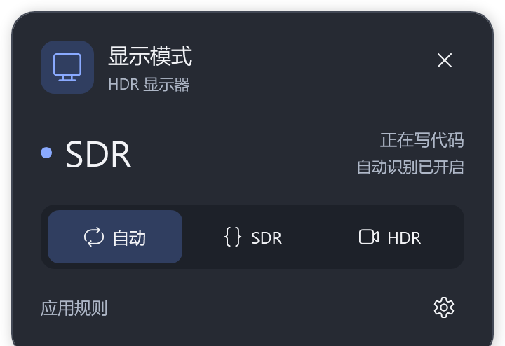
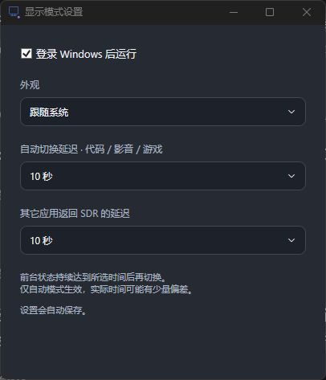

# FluentHDR

A Fluent-style Windows tray app for automatic SDR / HDR switching.

写代码用 SDR，看视频、玩游戏用 HDR。FluentHDR 根据前台应用自动切换 Windows 显示模式，也可以通过托盘面板固定 SDR 或 HDR。



## 下载与安装

适用于 **Windows 11 x64**，需要支持 HDR 的显示器。使用系统自带的 Windows PowerShell 5.1 和 .NET Framework 4.8 或更新版本，无需安装额外运行环境。

1. 从 [最新 Release](https://github.com/krfnsa-lab/FluentHDR/releases/latest) 下载 ZIP 安装包。
2. 完整解压到一个文件夹，双击 `Install.cmd`。
3. 点击右下角托盘的显示器图标。若图标被收起，先展开托盘隐藏图标区。

安装无需管理员权限，默认开启登录启动并进入自动模式。开始菜单搜索“显示模式”可以重新打开面板。安装完成后可移动或删除解压的安装包，运行程序使用自己的安装目录。

## 使用

| 模式 | 行为 |
| --- | --- |
| 自动 | 识别前台应用，按规则切换 SDR / HDR |
| SDR | 固定 SDR，直到选择其它模式 |
| HDR | 固定 HDR，直到选择其它模式 |

面板中的大字表示显示器实际状态，选中的按钮表示控制方式；蓝点表示 SDR，紫点表示 HDR。右键托盘图标也可以切换模式。

自动模式内置常见编辑器、终端、播放器、游戏和浏览器规则：代码应用使用 SDR，播放器和游戏使用 HDR，其它应用默认返回 SDR。后台播放视频时，前台代码应用仍优先使用 SDR。

点击“应用规则”可增删编辑器、播放器、游戏进程与游戏安装目录。未列出的游戏可以添加可执行文件或安装目录。规则保存后自动生效，无需重启。

点击齿轮打开设置，可以选择跟随系统、浅色或深色主题，以及是否登录时运行。



两组延迟可以分别调整：

- **自动切换延迟**：识别为代码、视频或游戏后等待多久再切换，默认 2 秒。
- **其它应用返回 SDR 的延迟**：回到其它应用后等待多久再恢复 SDR，默认 8 秒。

两项均支持 **1、2、3、5、8、10、15、30、60 秒**，选择后自动保存。前台状态需持续达到设定时间；轮询与显示器响应会带来少量偏差。手动固定 SDR 或 HDR 时不使用自动延迟。

## 识别范围

浏览器视频通过 Windows 媒体会话和当前页面标题进行识别，已知视频网站的全屏页面也可触发 HDR。网站、浏览器或播放方式可能未提供足够信息；识别不到时可手动选择 HDR。

HDR 是整块显示器的设置，会作用于该显示器上的所有窗口。FluentHDR 默认控制当前连接且支持 HDR 的显示器。开启 HDR 输出不会把 SDR 片源变成原生 HDR，最终效果仍取决于显示器、片源、游戏及其自身设置。

## 从源码构建

在仓库根目录运行：

```powershell
powershell -NoProfile -ExecutionPolicy Bypass -File .\Build.ps1
powershell -NoProfile -ExecutionPolicy Bypass -File .\Setup.ps1
```

`Build.ps1` 使用 Windows 自带的 .NET Framework 编译器生成程序与图标。`Setup.ps1` 安装并启动程序。这些命令仅为当前 PowerShell 进程设置执行策略，不修改系统的全局执行策略。

运行规则测试：

```powershell
powershell -NoProfile -ExecutionPolicy Bypass -File .\tests\Run.ps1
```

## 高级维护

运行程序安装在 `%LOCALAPPDATA%\CodexHdrSwitch\App`，此目录名是保留的内部标识。安装目录内的 `config.json` 保存当前规则和延迟，仓库根目录的同名文件提供默认值。重装保留现有配置并恢复自动模式；给 `Setup.ps1` 添加 `-KeepMode` 可保留手动模式，添加 `-ResetRules` 可恢复安装包中的默认配置。

设置、状态与日志保存在 `%LOCALAPPDATA%\CodexHdrSwitch`。应用识别在本机完成，运行工具不联网；日志记录进程名与切换原因，不记录浏览器或视频标题。图标使用 Windows 自带的 Segoe Fluent Icons 字体，安装包不包含字体文件。

右键“退出”会停止托盘和自动识别，并保留当前显示模式。如需停用登录启动，先在设置中关闭“登录 Windows 后运行”。卸载时，关闭登录启动并退出程序，再删除安装目录及开始菜单中的“显示模式”快捷方式即可。
